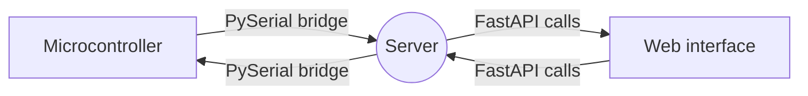

# Welcome to SPW_base!

SPW stands for Serial-Python-Web. It is a template that you can use to quickly set up a website that directly connects to a microcontroller (For example, one that runs GRBL)!  
This readme will contain a set-up guide and a small description of the functions already present in this template.

There are three important packages that this template uses:

- [**PySerial**](https://pythonhosted.org/pyserial/) to connect the system that runs this software to the microcontroller.
- the [**FastAPI**](https://fastapi.tiangolo.com)  webframework for the API calls.
- [**Uvicorn**](https://www.uvicorn.org) to host everything.

Currently everything in template is designed for communicating with [**GRBL**](https://github.com/grbl/grbl). But this can be easily changed by adjusting some lines of code in the serialBridge.py. This means that when a "Command" is mentioned, it is a [**G-code**](https://en.wikipedia.org/wiki/G-code) command.




# Set up guide
* First of all, fork this repository and give it a relevant name.
* Install the required python packages using 
```python
pip install -r requirements.txt
```
* Run the uvicorn command to host the website locally:
```python
uvicorn main:app --reload
```
# Files

| Filename    | Description |
| ----------- | ----------- |
| main.py      | Sets everything up      |
| router.py  			| Contains all the api endpoints       |
| serialBridge.py       | Establishes the connection between python and the microcontroller       |
|requirements.txt | Contains the required python packages       |
| index.html      | The website's homepage       |
| index.js 			| The javascript that runs on the homepage        |

You can add all the functionality you need to these files. This is just the start.
Currently there is no CSS file, this is because the index.html currently uses [**Bootstrap 5**](https://getbootstrap.com/docs/5.0/getting-started/introduction/)

# Functions
### main.py
```python
@app.on_event('startup')
async  def  app_startup():
 ```
 When the program starts, these are the first things that run.
### router.py
```python
@router.get("/example")
async  def  example():
```
An example of the most simple HTTP get request. It returns a string.

```python
@router.get("/goto")
async  def  goto(x: float, y: float, z: float, sys: int):
```
An example of an HTTP get request with arguments. And a useful function if you are working with a gantry.

### serialBridge.py
```python
async  def  send_command(self, command):
```
Sends a command in bytes over the serial bridge to the microcontroller. 

```python
async  def  stream_g_code_file(self, filename= 'grbl.gcode'):
```
Sends a whole file of commands in bytes over the serial bridge to the microcontroller
```python
async  def  goto(self, x: float, y: float, z: float, sys: int):
```
An example function that is useful for a gantry system

### index.js
In the index.js file you will find some functions that all relate to functions and API calls mentioned above


